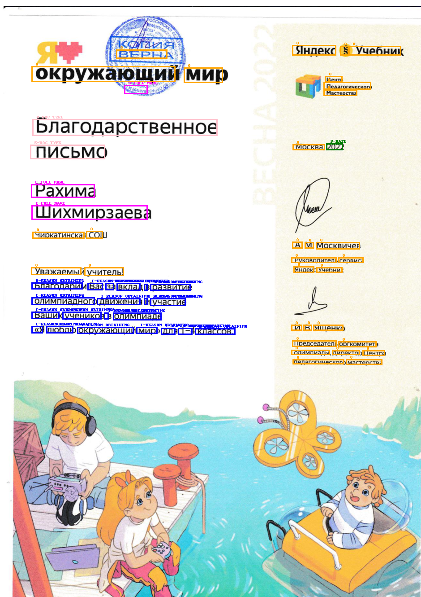

# LiLT on Parsing Individual Ahievement Documents data

## Цель проекта
> Цель проекта - разработка программного модуля для анализа документов, подтверждающих индивидуальные достижения, который позволит автоматически извлекать важную информацию из отсканированных документов и формировать из нее таблицу.

Следующая информация из документов такого типа позволит подтвердить валидность документа, его принадлежность автору, а также позволит оценить престижность документа:
* Дата получения
* ФИО владельца
* Тип документа
* Причина получения
* Место, которое занял владелец

## Задачи
При разработке проекта были сформулированы следующие задачи:
- [x] Сбор датасета. В открытых источниках нет датасета с размеченными документами, подтверждающими индивидуальные достижения, поэтому принято решение собрать и разметить его самостоятельно. 
- [X] Дообучение модели [`LiLT`](https://huggingface.co/docs/transformers/model_doc/lilt). В рамках исследования выбрана модель [nielsr/lilt-xlm-roberta-base](https://huggingface.co/nielsr/lilt-xlm-roberta-base) на основе токенизатора модели [FacebookAI/xlm-roberta-base](https://huggingface.co/FacebookAI/xlm-roberta-base).
Выбор данного стека позволяет использовать проект в коммерческих целях, так как модели распространяются под лицензией `MIT`.
- [x] Построение инференса модели, внедрение OCR. В качестве алгоритма OCR выбран [Yandex Vision OCR](https://yandex.cloud/ru/services/vision).

## Датасет
Датасет `PIAD` (Parsing Individual Ahievement Documents) включает в себя **215** отсканированных документов. Данный набор состоит из личных документов автора, документов, которыми поделились друзья и коллеги, и документов, найденных в открытых источниках. 
Разметка проводилась с помощью удобного инструмента [ubiAI](https://ubiai.tools/)
> [!NOTE]
> PIAD не выложен в открытый доступ, так как некоторые элементы содержат персональные данные.

## Дообучение LiLT
Перед дообучением модели требуется привести датасет в формат, подходящий для обучения из формата, получаемого с ubiAI. За предобработку данных отвечает скрипт [preprocessing_data.ipynb](https://github.com/koshkidadanet/lilt-finetuning-piad-ya-ocr/blob/main/preprocessing_data.ipynb).

Скрипт [finetuning_lilt_model_kgl.ipynb](https://github.com/koshkidadanet/lilt-finetuning-piad-ya-ocr/blob/main/finetuning_lilt_model_kgl.ipynb) отвечает за дообучение модели на платформе Kaggle.  
* F1-score для всех сущностей - **0.877**  
* F1-score для сущностей без `Причина получения` - **0.927**

## Инференс 
Скрипт [inference_kgl.ipynb](https://github.com/koshkidadanet/lilt-finetuning-piad-ya-ocr/blob/main/inference_kgl.ipynb) отвечает за инференс алгоритма на платформе Kaggle с использованием `Yandex Vision OCR`. В данном скрипте можно увидеть пример работы алгоиртма на нескольких документах из валидационной выборки и итоговую таблицу в виде **pd.DataFrame**. 

**Пример разметки документа**  
